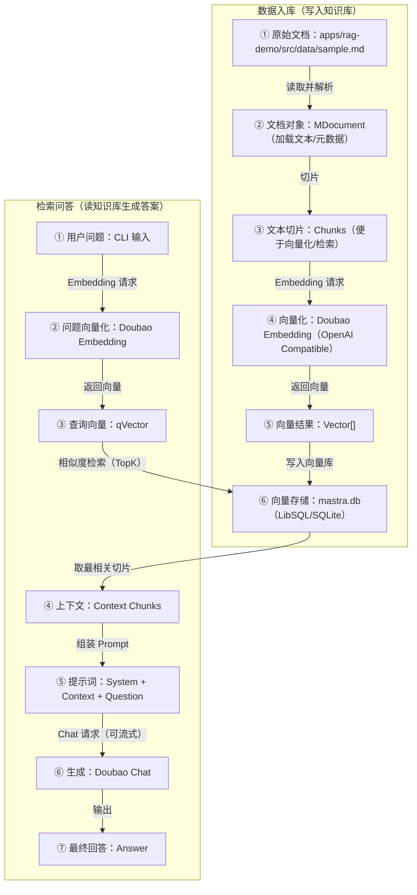

# Agents-RAG-example

一个包含 3 个子项目的 RAG 示例仓库：Mastra 版本、LangChain 版本，以及面向复用的 LangChain RAG SDK + 测试/服务端 Playground。

## 1. 项目说明文件

下表列出本仓库最常用的 3 份核心文档，并说明文件与用途。

| 文档类型 | 文件                                                                                                                               | 作用                                                           |
| -------- | ---------------------------------------------------------------------------------------------------------------------------------- | -------------------------------------------------------------- |
| 技术文档 | [apps/langchain-rag/RAG_FLOW.md](./apps/langchain-rag/RAG_FLOW.md)                                                                 | LangChain 版本 RAG 的流程说明（入库/检索/生成/关键组件对照）。 |
| API 文档 | [apps/langchain-sdk/nest-test/src/modules/rag/rag.controller.ts](./apps/langchain-sdk/nest-test/src/modules/rag/rag.controller.ts) | Nest 服务端 RAG 接口实现（路由/入参/返回结构）。               |
| 部署文档 | [apps/rag-demo/docker-compose.yml](./apps/rag-demo/docker-compose.yml)                                                             | Mastra Demo 的部署编排入口（配合环境变量启动依赖与服务）。     |

## 2. 项目核心作用

- **apps/rag-demo（Mastra RAG Demo）**：主要解决“在本地快速把私有 Markdown/文本变成可问答知识库”的问题，面向想要最低成本验证 RAG 效果的开发者、产品同学或需要做 PoC 的团队。它以 TypeScript/Node.js 为运行基础，使用 Mastra 框架组织 Agent 与 RAG 逻辑，通过 OpenAI Compatible 接口对接火山引擎（Doubao）的对话与向量模型，并默认采用 LibSQL（SQLite 文件模式）作为向量存储，减少环境依赖、便于复现。技术特点是链路清晰、脚本化（ingest/query/test），适合把“数据入库—检索—生成”的端到端流程跑通并用于对比不同模型与切分策略。

- **apps/langchain-rag（LangChain RAG Demo）**：主要解决“用原生 LangChain 组件搭建一套可解释、可替换的 RAG 流水线”的问题，面向偏工程实现与组件组合的开发者、需要研究检索链路与向量库行为的同学。项目使用 TypeScript + LangChain（LCEL/Runnable）组织链路，Embedding 与 Chat 通过 OpenAI 兼容配置对接火山引擎，向量库采用 HNSWLib（本地文件索引）以获得轻量的近似最近邻检索能力。技术特点是组件对照明确（Loader/Splitter/Embeddings/VectorStore/Model/Chain），便于在不同 Retriever、Prompt、K 值与输出解析策略之间做快速试验与性能/效果对比。

- **apps/langchain-sdk（LangChain RAG SDK + Playground）**：主要解决“把 RAG 的存储、追加、检索与模型调用封装成可复用 SDK，并提供脚本与服务端示例便于集成”的问题，面向需要在多个项目/服务中复用同一套 RAG 能力的开发者。该子项目包含一个 TypeScript SDK（`sdk/`）用于统一向量存储与调用接口，一个 Node 脚本测试工程（`sdk-test/`）用于快速验证初始化/追加/查询流程，以及一个 Nest 服务端示例（`nest-test/`）用于提供 HTTP API 形态的 RAG 能力。技术特点是模块化封装、可被脚本与服务端同时复用，适合从 Demo 走向可集成组件的演进路径。

## 3. 项目内 README 导航

- [Mastra RAG Demo](./apps/rag-demo/README.md)
- [LangChain RAG Demo](./apps/langchain-rag/README.md)
- [LangChain SDK Playground](./apps/langchain-sdk/README.md)

## 4. RAG 流程说明

下面以 `apps/rag-demo`（Mastra 版本）为例说明端到端流程。

**数据入库阶段**：① 读取源文档 → ② 构建文档对象 → ③ 切成可检索片段 → ④ 对片段做向量化 → ⑤ 得到向量结果 → ⑥ 写入本地向量库。  
**检索问答阶段**：① 接收问题 → ② 将问题向量化 → ③ 得到查询向量 → ④ 从向量库检索相关片段 → ⑤ 拼出带上下文的提示词 → ⑥ 调用对话模型生成 → ⑦ 返回答案。
